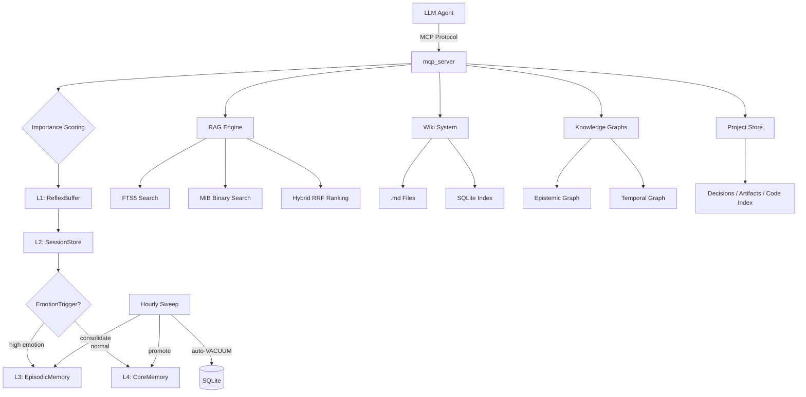

# a-memory

> **Your AI agents forget. a-memory makes them remember.**
> 4-tier agent memory with hybrid search and a real knowledge graph — all in plain SQLite files. Zero cloud. Zero external APIs.

[](https://github.com/Cipher208/a-memory/actions/workflows/ci.yml)
[](https://codecov.io/gh/Cipher208/a-memory)
[](https://opensource.org/licenses/MIT)
[](https://www.python.org/downloads/)
[](https://github.com/astral-sh/ruff)
[](https://modelcontextprotocol.io/)
[](https://cipher208.github.io/a-memory/)
[](https://github.com/Cipher208/a-memory/releases)

> Also available on PyPI: [`pip install a-memory`](https://pypi.org/project/a-memory/) —
> optional extras: `a-memory[embeddings]` for real multilingual embeddings.

---

## Why SQLite?

Every other memory server sends your agent's data through a cloud API or requires a separate vector database.

**a-memory stores everything in SQLite files on your machine.**

- **Zero infrastructure.** No Docker, no database server, no embedding API keys.
- **Zero data leaving your network.** Works air-gapped.
- **Layer-isolated by design.** User facts and agent identity never share a namespace.
- **One directory = entire memory.** Back up with `cp`, sync with rsync.

---

## Why this exists

Three problems a-memory solves:

**① Agent self-evolution** — your AI stops repeating mistakes between sessions. It remembers decisions, errors, and corrections in a dedicated agent layer, and an hourly consolidation sweep promotes what matters into long-term facts.

**② User persona persistence** — your agent knows who it's talking to even after weeks of silence. Preferences, history, emotional context live in the user layer, isolated from agent identity.

**③ Project continuity** — `project` tracks per-project context: decisions with rationale and outcomes, artifact maps, a graphify-powered code index — so a fresh session picks up where the last one left off.

---

## Get started

```bash
pip install a-memory
a-memory          # MCP server on stdio — connect from any MCP client
```

Point your MCP client at it:

```json
{
  "mcpServers": {
    "a-memory": {
      "command": "a-memory"
    }
  }
}
```

HTTP transport with dashboard:

```bash
a-memory --transport http --port 8000 --dashboard
```

Or run from source:

```bash
git clone https://github.com/Cipher208/a-memory.git
cd a-memory
uv sync
uv run ariel-memory
```

---

## The five primitives

Agents see exactly six tools — one verb per intent (5 verbs + memory_hook), no tool-choice paralysis:

| Primitive | Intent | What it does |
|---|---|---|
| **`think`** | remember | Routes content to the right layer (L4 facts / L3 episodes / wiki / graph) based on importance, emotion, and relations |
| **`dream`** | recall | Hybrid search across ALL layers (FTS5 + binary embeddings + wiki + graph), returns a token-budgeted digest |
| **`forget`** | let go | Context-aware deletion with Shadow Bin archival (exact / fuzzy / recent) |
| **`evolve`** | grow | Records personality/rules evolution for the agent |
| **project** | continue | Per-project identity, decision log, artifact map, code index |

Quick demo — Python MCP client:

```python
# think — routed to the right store automatically
await session.call_tool("think", {"text": "User prefers dark mode", "layer": "user"})

# dream — finds it across every store, a week later
res = await session.call_tool("dream", {"query": "dark mode preference"})
print(res["summary"])
```

65 fine-grained operations exist in total, grouped into coherent opt-in tiers: the 6 primitives are exposed by default; add `context` (recall protocol, /new session recap, smart context budget, steering hints, tool-output compression), `insight` (Memory Query DSL, provenance fact-blame, quality loop, reflections, stats), `write` (typed memory schemas, declarative rules engine, scratchpad, counterfactuals, episodes), plus `wiki`, `brief`, and `review` (staged mutations) — e.g. `ARIEL_EXPOSE=primitives,context,insight,write,wiki,brief,review` (57 tools; the remaining 8 are admin-tier, exposed only via `ARIEL_EXPOSE=all`).

> **⚠️ Env sanitization gotcha (stdio):** MCP clients pass a *sanitized* environment to stdio servers — setting `ARIEL_EXPOSE` in your shell profile does nothing. Define the tier set in your **MCP client config** (the `env` block of the server entry — see [configuration guide](docs/getting-started/configuration.md)). The server logs its resolved surface at startup (`tool exposure: N/M tools`) — if your agent reports seeing only the primitives, check that line first, then restart the client session (tool lists are cached per session).

---

## Features

| Category | What's inside |
|----------|--------------|
| 🧠 **Memory** | L1 Reflex (atomic persistence) → L2 Sessions → L3 Episodic → L4 Core, importance scoring, typed memory kinds with TTL policies, layer isolation; **bi-temporal fact history** (is_current view hides superseded rows globally, `changed_since` delta-polling, drill-down to raw source surviving cold archival), hash-chained L0 journal with hot/warm/cold tiers; **65 tools** (tiered exposure; 57 on the common combo, 6 primitives by default) including `/recall` protocol (multi-axis + disclosure triggers), session continuity recap (/new recovery pack), steering hints, tool-output compression + recall verification, provenance fact-blame, Memory Query DSL (faceted tags), typed memory schemas, a declarative rules engine, smart context budget (weighted token floors), reflections, counterfactuals, was_useful quality loop, operator diagnose/heal + integrity score |
| 🔍 **Search** | FTS5 + MIB binary embeddings + hybrid RRF ranking, multi-source merge (RAG + Wiki + Episodic + Core + Graph), **EDM/ITS dual-route rerank** (information-gain scoring, №11-eval winner), semantic dedup gate (cosine, opt-in), RU-lemma key normalization (pymorphy3), counter-signal pessimisation, ACT-R activation with per-query min-max multipliers and memory-kind weights, embedding-path circuit breaker (graceful hash-fallback), deterministic retrieval mode, dream digest |
| 🕸️ **Graph** | Epistemic knowledge graph + temporal timeline, typed nodes and edges, BFS traversal, 1-hop GraphRAG expansion (provenance-aware edge filter), **12 self-maintaining miners** (degree-capped anti-hub, wiki↔fact provenance bridges with metadata backlinks, co-retrieval, zero-result gaps), orphan-anchor GC, nightly gap-registry, opt-in HDBSCAN embedding clusters with louvain agreement |
| 📁 **Projects** | Decision log (what/why/outcome), artifact map, graphify code index — survives between sessions |
| ⚡ **Auto-Hooks** | Push-model memory: a per-agent daemon tails the conversation and ariel saves what matters on its own — importance thresholds (EMA-adaptive), staged mutations (proposal → review → apply → revert), `DREAM:` markers, session-start inject, gap reports, **compaction-aware rehydrate** (drift log + salvage + one-shot rehydrate blocks), ru-NER privacy gate (cyrillic PERSON/ORG/LOC masking). **Native integrations**: Hermes runs ariel as an in-process `MemoryProvider` plugin, MiMoCode via a fork-hooks plugin, CowAgent via code-level hooks. [Wiring guide →](docs/hooks/autohooks-platforms.md) |
| 🎯 **Skills** | Skill = Memory: agent-read Markdown pages (first-class `skill` wiki type), progressive disclosure (`wiki_list → wiki_search → wiki_read` with related-facts hydration), 4KB lint cap, promotion from `DREAM: skill:` episodes, shared SSOT sync across agents, usage-driven reinforcement — [skills guide →](docs/features/skills.md) |
| 🔐 **Security** | NaCl `SecretBox` (XSalsa20-Poly1305) envelope encryption for auth/saga secrets, master key chain, rate limiting |
| 🛠️ **Ops** | Auto-backup cron, saga rollback pattern, Prometheus metrics, read-only replica, hourly self-maintenance (decay + consolidation + auto-VACUUM) |
| 🌐 **Wiki** | FTS5-indexed markdown files — edit in Obsidian/VS Code, search from MCP, 6 analytical perspectives (`wiki_summarize`), schema lint on save, external-dir sync |

---

## Architecture



---

## Comparison

| | a-memory | mem0 | letta (memgpt) | chroma |
|---|---|---|---|---|
| **MCP native** | ✅ 6 primitives | ❌ no MCP server | ❌ | ❌ |
| **Layer isolation** | ✅ User vs Agent namespaces | ❌ | ❌ | ❌ |
| **Local-only (no cloud)** | ✅ **SQLite — 0 infra** | ⚠️ API or self-host Docker | ❌ needs LLM API | ✅ local OSS + Cloud option |
| **Own semantic search (no API)** | ✅ FTS5 + MIB binary hybrid | ⚠️ BM25+entity (LLM-dependent) | ❌ LLM-only | ⚠️ hybrid on Cloud only |
| **Knowledge graph** | ✅ Typed nodes + edges + temporal timeline | ⚠️ entities only | ❌ | ❌ |
| **Envelope encryption (secrets)** | ✅ NaCl SecretBox (auth/saga secrets; memory data is plaintext SQLite) | ❌ | ❌ | ❌ |
| **Lifecycle hooks** | ✅ 19 names, per-layer, config-gated | limited | limited | none |
| **Self-maintenance** | ✅ Hourly consolidation + auto-VACUUM | ❌ | ❌ | ❌ |
| **Backup / restore** | ✅ Auto-cron + saga rollback | ❌ | ❌ | ❌ |

Notes (Sep 2026): mem0 now ships a self-hosted Docker image and a managed cloud with hybrid BM25+entity search; chroma is 29k★ and added hybrid+FTS5 to its Cloud tier (OSS server remains vector-only). What still differentiates a-memory: zero-infra SQLite (no Docker), NaCl-encrypted auth/saga secrets, layer isolation, hourly self-maintenance, and the temporal graph timeline.

---

## Roadmap

- [x] 4-layer memory hierarchy with layer isolation
- [x] Hybrid search (FTS5 + MIB binary embeddings)
- [x] Knowledge graphs (epistemic + temporal)
- [x] Hourly consolidation sweep + DB self-maintenance
- [x] mcp 2.x native SDK
- [x] Repo renamed to `Cipher208/a-memory`; PyPI package live (`pip install a-memory`)
- [x] **Temporal timeline wired end to end (think/evolve/project events + dream recent digest)**
- [x] **Dream-cycle inject + auto-generated CONTEXT.md snapshot** (curated context + 6 wiki perspectives + recent episodes, per-layer, per-agent)
- [x] **Phase C — auto-hooks keystone** (push-model memory: per-agent conversation daemons, external event dispatcher, importance-gated auto-save, staged mutations with review/revert, dream markers, session-start inject, gap reports; [guide](docs/hooks/autohooks-platforms.md))
- [x] **Phase D — compaction-aware rehydrate** (drift log + salvage into the summarizer + one-shot rehydrate blocks; MiMoCode plugin / Hermes native MemoryProvider / CowAgent hooks — [integration guide](docs/hooks/autohooks-platforms.md))
- [x] **Phase D — /recall protocol** (multi-axis proportional recall: markers → session → semantic → expand → day; drives Hermes per-turn prefetch)
- [x] **Phase D — Skill = Memory** (Markdown skills as a first-class wiki type, progressive disclosure `wiki_list → wiki_search → wiki_read`, 4KB lint cap, promotion pipeline, shared SSOT sync, usage-driven evolution — [skills guide](docs/features/skills.md))
- [x] **Phase D — working memory + meta-memories** (agent scratchpad re-injected at session start, deterministic reflections, smart context budget with weighted floors, counterfactual notes, was_useful quality feedback loop)
- [x] **Phase D — memory tools D1.2-D1.9** (session continuity recap + steering hints, tool-output compression + recall verification, provenance fact-blame, Memory Query DSL, typed memory schemas, declarative rules engine; coherent `ARIEL_EXPOSE` tiers: context / insight / write)
- [x] **Phase E — hardening & closure** (18 items across 3 waves): **durability** — atomic L1 persistence (temp→fsync→os.replace) + per-instance ring files, a circuit breaker guarding the embedding model path (3 failures → open 30s → hash-fallback keeps recall serving), least-privilege wiki roots + traversal-safe backup restore; **operations** — `memory_diagnose`/`memory_heal` (DB/migrations/L1-files/breaker checks + remigrate/reset-breakers/purge), integrity score in the report card, `<cache:break>` markers + stable-first inject ordering for provider prompt caches; **retrieval** — faceted tag queries (`dimension:value`, same-dim OR / cross-dim AND), memory-kind weights in ACT-R scoring, disclosure triggers («when X, surface Y» recall-side rules); **wiring** — real `context_threshold`/`memory_pressure` emitters (Hermes plugin + autohooks daemon), `on_turn_end` event, `wiki_write` staged mutations with revert, transition-level consolidation revert, causal-link producer on `memory_graph_add`; **validation** — DREAM markers anchored to message start (document-fragment false positives eliminated), post-compaction semantic audit (episode coverage by the L4 set)
- [x] **Phase F — L0→L4 pipeline** (bi-temporal fact intervals, hot/warm/cold L0 tiers with CLACK export, SHA-256 capture dedup, hash-chained journal, provenance drill-down)
- [x] **Phase G — self-wiring graph** (12 deterministic miners: sessions, markers, provenance, co-retrieval, entities, zero-result questions, wiki↔fact bridges)
- [x] **Phase H closeout — EDM/ITS dual-route rerank** + eval harness (NDCG@5, drift score, negative-control protocol, LongMemEval-S adapter)
- [x] **S17 Stage-1 tail** — deterministic retrieval mode, ENGRAM procedural kind, AdaptiveRAG pre-gate (27 LLM-free query features), EMA importance gate, counter-signal aliases, SHA-256 L0 dedup, zero-result miner, ru-NER privacy gate
- [x] **S18-19 wave** (15 items) — global is_current view + `changed_since` delta mode, per-query ACT-R min-max, per-block max_chars, semantic dedup gate, channel-granular sources, 3-option conflict contract (supersede/retain/annotate), orphan-anchor GC, nightly gap-registry, per-agent harness breaker, provenance edge filter, wiki↔fact metadata backlinks, `wiki_read` related-facts hydration, RU lemma keys (pymorphy3), 2-class textcat pilot (flag-gated), S17 supplements 8-11 (cold-archive drill-down, confirming layer, junk-vector detector, HDBSCAN clusters), B6 anti-hub degree cap
- [x] **S20 eval** — №11 ablation on MINI + LongMemEval-S (50-question stride): full dual-route arm wins on both datasets, published-baseline comparison (GPT-4o long-context league, above ChatGPT-memory); dense e5-small run 3: no parity gain over hash on this split — hash stays prod
- [ ] **Screenshot / asciinema demo** in README
- [ ] **LLM-assisted consolidation** on top of the deterministic sweep
- [ ] **Stage 2 — tool-surface redesign** (slot system, URI keys, inject/key consolidation — planned with the A-remainder)
- [ ] **LongMemEval full 500-question split** + dense-aware threshold retraining (e5-small parity shown, not a win on the 50-question stride)

## Contributing

PRs welcome! See [CONTRIBUTING.md](CONTRIBUTING.md).

## License

MIT © Cipher208

---

⭐ **If this project helps you, star it on GitHub.**

[](https://star-history.com/#Cipher208/a-memory&Timeline)
