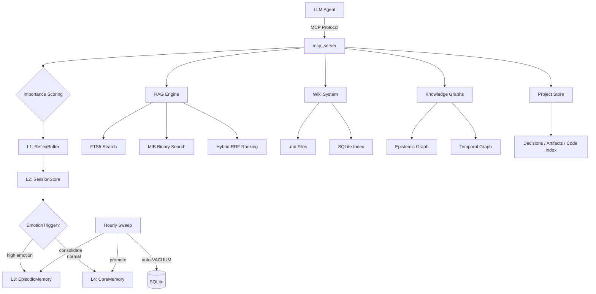

# a-memory

> **Your AI agents forget. a-memory makes them remember.**
> 4-tier agent memory with hybrid search, a real knowledge graph, and envelope encryption — all in plain SQLite files. Zero cloud. Zero external APIs.

[](https://github.com/Cipher208/a-memory/actions/workflows/ci.yml)
[](https://codecov.io/gh/Cipher208/a-memory)
[](https://opensource.org/licenses/MIT)
[](https://www.python.org/downloads/)
[](https://github.com/astral-sh/ruff)
[](https://modelcontextprotocol.io/)
[](https://cipher208.github.io/a-memory/)
[](https://github.com/Cipher208/a-memory/releases)

> Also available on PyPI: [`pip install a-memory`](https://pypi.org/project/a-memory/) —
> optional extras: `a-memory[embeddings]` for real multilingual embeddings.

---

## Why SQLite?

Every other memory server sends your agent's data through a cloud API or requires a separate vector database.

**a-memory stores everything in SQLite files on your machine.**

- **Zero infrastructure.** No Docker, no database server, no embedding API keys.
- **Zero data leaving your network.** Works air-gapped.
- **Layer-isolated by design.** User facts and agent identity never share a namespace.
- **One directory = entire memory.** Back up with `cp`, sync with rsync.

---

## Why this exists

Three problems a-memory solves:

**① Agent self-evolution** — your AI stops repeating mistakes between sessions. It remembers decisions, errors, and corrections in a dedicated agent layer, and an hourly consolidation sweep promotes what matters into long-term facts.

**② User persona persistence** — your agent knows who it's talking to even after weeks of silence. Preferences, history, emotional context live in the user layer, isolated from agent identity.

**③ Project continuity** — `project` tracks per-project context: decisions with rationale and outcomes, artifact maps, a graphify-powered code index — so a fresh session picks up where the last one left off.

---

## Get started

```bash
pip install a-memory
a-memory          # MCP server on stdio — connect from any MCP client
```

Point your MCP client at it:

```json
{
  "mcpServers": {
    "a-memory": {
      "command": "a-memory"
    }
  }
}
```

HTTP transport with dashboard:

```bash
a-memory --transport http --port 8000 --dashboard
```

Or run from source:

```bash
git clone https://github.com/Cipher208/a-memory.git
cd a-memory
uv sync
uv run ariel-memory
```

---

## The five primitives

Agents see exactly five tools — one verb per intent, no tool-choice paralysis:

| Primitive | Intent | What it does |
|---|---|---|
| **`think`** | remember | Routes content to the right layer (L4 facts / L3 episodes / wiki / graph) based on importance, emotion, and relations |
| **`dream`** | recall | Hybrid search across ALL layers (FTS5 + binary embeddings + wiki + graph), returns a token-budgeted digest |
| **`forget`** | let go | Context-aware deletion with Shadow Bin archival (exact / fuzzy / recent) |
| **`evolve`** | grow | Records personality/rules evolution for the agent |
| **project** | continue | Per-project identity, decision log, artifact map, code index |

Quick demo — Python MCP client:

```python
# think — routed to the right store automatically
await session.call_tool("think", {"text": "User prefers dark mode", "layer": "user"})

# dream — finds it across every store, a week later
res = await session.call_tool("dream", {"query": "dark mode preference"})
print(res["summary"])
```

56 fine-grained operations exist in total, grouped into coherent opt-in tiers: the 6 primitives are exposed by default; add `context` (recall protocol, /new session recap, smart context budget, steering hints, tool-output compression), `insight` (Memory Query DSL, provenance fact-blame, quality loop, reflections, stats), `write` (typed memory schemas, declarative rules engine, scratchpad, counterfactuals, episodes), plus `wiki`, `brief`, and `review` (staged mutations) — e.g. `ARIEL_EXPOSE=primitives,context,insight,write,wiki,brief,review` (46 tools), or everything via `ARIEL_EXPOSE=all`.

---

## Features

| Category | What's inside |
|----------|--------------|
| 🧠 **Memory** | L1 Reflex → L2 Sessions → L3 Episodic → L4 Core, importance scoring, typed memory kinds with TTL policies, layer isolation; **56 tools** including `/recall` protocol (multi-axis), session continuity recap (/new recovery pack), steering hints, tool-output compression + recall verification, provenance fact-blame, Memory Query DSL, typed memory schemas, a declarative rules engine, smart context budget (weighted token floors), reflections, counterfactuals, was_useful quality loop |
| 🔍 **Search** | FTS5 + MIB binary embeddings + hybrid RRF ranking, multi-source merge (RAG + Wiki + Episodic + Core + Graph), ACT-R activation scoring, dream digest |
| 🕸️ **Graph** | Epistemic knowledge graph + temporal timeline, typed nodes and edges, BFS traversal, 1-hop GraphRAG expansion |
| 📁 **Projects** | Decision log (what/why/outcome), artifact map, graphify code index — survives between sessions |
| ⚡ **Auto-Hooks** | Push-model memory: a per-agent daemon tails the conversation and ariel saves what matters on its own — importance thresholds, staged mutations (proposal → review → apply → revert), `DREAM:` markers, session-start inject, gap reports, **compaction-aware rehydrate** (drift log + salvage + one-shot rehydrate blocks). **Native integrations**: Hermes runs ariel as an in-process `MemoryProvider` plugin, MiMoCode via a fork-hooks plugin, CowAgent via code-level hooks. [Wiring guide →](docs/hooks/autohooks-platforms.md) |
| 🎯 **Skills** | Skill = Memory: agent-read Markdown pages (first-class `skill` wiki type), progressive disclosure (`wiki_list → wiki_search → wiki_read`), 4KB lint cap, promotion from `DREAM: skill:` episodes, shared SSOT sync across agents, usage-driven reinforcement — [skills guide →](docs/features/skills.md) |
| 🔐 **Security** | Envelope encryption (NaCl `SecretBox` = XSalsa20-Poly1305), master key chain, rate limiting |
| 🛠️ **Ops** | Auto-backup cron, saga rollback pattern, Prometheus metrics, read-only replica, hourly self-maintenance (decay + consolidation + auto-VACUUM) |
| 🌐 **Wiki** | FTS5-indexed markdown files — edit in Obsidian/VS Code, search from MCP, 6 analytical perspectives (`wiki_summarize`), schema lint on save, external-dir sync |

---

## Architecture



---

## Comparison

| | a-memory | mem0 | letta (memgpt) | chroma |
|---|---|---|---|---|
| **MCP native** | ✅ 5 primitives | ❌ no MCP server | ❌ | ❌ |
| **Layer isolation** | ✅ User vs Agent namespaces | ❌ | ❌ | ❌ |
| **Local-only (no cloud)** | ✅ **SQLite — 0 infra** | ⚠️ API or self-host Docker | ❌ needs LLM API | ✅ local OSS + Cloud option |
| **Own semantic search (no API)** | ✅ FTS5 + MIB binary hybrid | ⚠️ BM25+entity (LLM-dependent) | ❌ LLM-only | ⚠️ hybrid on Cloud only |
| **Knowledge graph** | ✅ Typed nodes + edges + temporal timeline | ⚠️ entities only | ❌ | ❌ |
| **Envelope encryption** | ✅ NaCl SecretBox at rest | ❌ | ❌ | ❌ |
| **Lifecycle hooks** | ✅ 19 names, per-layer, config-gated | limited | limited | none |
| **Self-maintenance** | ✅ Hourly consolidation + auto-VACUUM | ❌ | ❌ | ❌ |
| **Backup / restore** | ✅ Auto-cron + saga rollback | ❌ | ❌ | ❌ |

Notes (Sep 2026): mem0 now ships a self-hosted Docker image and a managed cloud with hybrid BM25+entity search; chroma is 29k★ and added hybrid+FTS5 to its Cloud tier (OSS server remains vector-only). What still differentiates a-memory: zero-infra SQLite (no Docker), NaCl encryption at rest, layer isolation, hourly self-maintenance, and the temporal graph timeline.

---

## Roadmap

- [x] 4-layer memory hierarchy with layer isolation
- [x] Hybrid search (FTS5 + MIB binary embeddings)
- [x] Knowledge graphs (epistemic + temporal)
- [x] Hourly consolidation sweep + DB self-maintenance
- [x] mcp 2.x native SDK
- [x] Repo renamed to `Cipher208/a-memory`; PyPI package live (`pip install a-memory`)
- [x] **Temporal timeline wired end to end (think/evolve/project events + dream recent digest)**
- [x] **Dream-cycle inject + auto-generated CONTEXT.md snapshot** (curated context + 6 wiki perspectives + recent episodes, per-layer, per-agent)
- [x] **Phase C — auto-hooks keystone** (push-model memory: per-agent conversation daemons, external event dispatcher, importance-gated auto-save, staged mutations with review/revert, dream markers, session-start inject, gap reports; [guide](docs/hooks/autohooks-platforms.md))
- [x] **Phase D — compaction-aware rehydrate** (drift log + salvage into the summarizer + one-shot rehydrate blocks; MiMoCode plugin / Hermes native MemoryProvider / CowAgent hooks — [integration guide](docs/hooks/autohooks-platforms.md))
- [x] **Phase D — /recall protocol** (multi-axis proportional recall: markers → session → semantic → expand → day; drives Hermes per-turn prefetch)
- [x] **Phase D — Skill = Memory** (Markdown skills as a first-class wiki type, progressive disclosure `wiki_list → wiki_search → wiki_read`, 4KB lint cap, promotion pipeline, shared SSOT sync, usage-driven evolution — [skills guide](docs/features/skills.md))
- [x] **Phase D — working memory + meta-memories** (agent scratchpad re-injected at session start, deterministic reflections, smart context budget with weighted floors, counterfactual notes, was_useful quality feedback loop)
- [x] **Phase D — memory tools D1.2-D1.9** (session continuity recap + steering hints, tool-output compression + recall verification, provenance fact-blame, Memory Query DSL, typed memory schemas, declarative rules engine; coherent `ARIEL_EXPOSE` tiers: context / insight / write)
- [ ] **Screenshot / asciinema demo** in README
- [ ] **LLM-assisted consolidation** on top of the deterministic sweep
- [ ] **Phase D remainder** — memory branches / stash / versioning (D1.11/12/14), procedural memory core (D2.5), persona graph (D3.1-D3.4, separate MCP server), cross-audit + memory tiers (D3.6/D3.7)

## Contributing

PRs welcome! See [CONTRIBUTING.md](CONTRIBUTING.md).

## License

MIT © Cipher208

---

⭐ **If this project helps you, star it on GitHub.**

[](https://star-history.com/#Cipher208/a-memory&Timeline)
