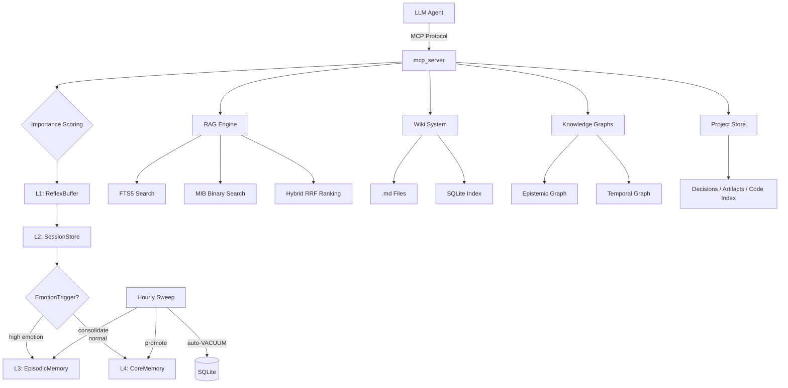

# a-memory

> **Your AI agents forget. a-memory makes them remember.**
> 4-tier agent memory with hybrid search, a real knowledge graph, and envelope encryption — all in plain SQLite files. Zero cloud. Zero external APIs.

[](https://github.com/Cipher208/a-memory/actions/workflows/ci.yml)
[](https://codecov.io/gh/Cipher208/a-memory)
[](https://opensource.org/licenses/MIT)
[](https://www.python.org/downloads/)
[](https://github.com/astral-sh/ruff)
[](https://modelcontextprotocol.io/)
[](https://cipher208.github.io/a-memory/)
[](https://github.com/Cipher208/a-memory/releases)

> **Naming note:** the product name is **a-memory**; this repository is still
> `Cipher208/a-memory` (renaming is pending — all links above use the
> current name).

---

## Why SQLite?

Every other memory server sends your agent's data through a cloud API or requires a separate vector database.

**a-memory stores everything in SQLite files on your machine.**

- **Zero infrastructure.** No Docker, no database server, no embedding API keys.
- **Zero data leaving your network.** Works air-gapped.
- **Layer-isolated by design.** User facts and agent identity never share a namespace.
- **One directory = entire memory.** Back up with `cp`, sync with rsync.

---

## Why this exists

Three problems a-memory solves:

**① Agent self-evolution** — your AI stops repeating mistakes between sessions. It remembers decisions, errors, and corrections in a dedicated agent layer, and an hourly consolidation sweep promotes what matters into long-term facts.

**② User persona persistence** — your agent knows who it's talking to even after weeks of silence. Preferences, history, emotional context live in the user layer, isolated from agent identity.

**③ Project continuity** — `project` tracks per-project context: decisions with rationale and outcomes, artifact maps, a graphify-powered code index — so a fresh session picks up where the last one left off.

---

## Get started

```bash
pip install a-memory
a-memory          # MCP server on stdio — connect from any MCP client
```

Point your MCP client at it:

```json
{
  "mcpServers": {
    "a-memory": {
      "command": "a-memory"
    }
  }
}
```

HTTP transport with dashboard:

```bash
a-memory --transport http --port 8000 --dashboard
```

Or run from source:

```bash
git clone https://github.com/Cipher208/a-memory.git
cd a-memory
uv sync
uv run ariel-memory
```

---

## The five primitives

Agents see exactly five tools — one verb per intent, no tool-choice paralysis:

| Primitive | Intent | What it does |
|---|---|---|
| **`think`** | remember | Routes content to the right layer (L4 facts / L3 episodes / wiki / graph) based on importance, emotion, and relations |
| **`dream`** | recall | Hybrid search across ALL layers (FTS5 + binary embeddings + wiki + graph), returns a token-budgeted digest |
| **`forget`** | let go | Context-aware deletion with Shadow Bin archival (exact / fuzzy / recent) |
| **`evolve`** | grow | Records personality/rules evolution for the agent |
| **project** | continue | Per-project identity, decision log, artifact map, code index |

Quick demo — Python MCP client:

```python
# think — routed to the right store automatically
await session.call_tool("think", {"text": "User prefers dark mode", "layer": "user"})

# dream — finds it across every store, a week later
res = await session.call_tool("dream", {"query": "dark mode preference"})
print(res["summary"])
```

~30 additional fine-grained operations (typed CRUD per store, sessions, ops/admin) stay available behind `ARIEL_EXPOSE=all`.

---

## Features

| Category | What's inside |
|----------|--------------|
| 🧠 **Memory** | L1 Reflex → L2 Sessions → L3 Episodic → L4 Core, importance scoring, typed memory kinds with TTL policies, layer isolation |
| 🔍 **Search** | FTS5 + MIB binary embeddings + hybrid RRF ranking, multi-source merge (RAG + Wiki + Episodic + Core + Graph), dream digest |
| 🕸️ **Graph** | Epistemic knowledge graph + temporal timeline, typed nodes and edges, BFS traversal |
| 📁 **Projects** | Decision log (what/why/outcome), artifact map, graphify code index — survives between sessions |
| 🔐 **Security** | Envelope encryption (libsodium secretbox), master key chain, rate limiting |
| 🛠️ **Ops** | Auto-backup cron, saga rollback pattern, Prometheus metrics, read-only replica, hourly self-maintenance (decay + consolidation + auto-VACUUM) |
| 🌐 **Wiki** | FTS5-indexed markdown files — edit in Obsidian/VS Code, search from MCP |

---

## Architecture



---

## Comparison

| | a-memory | mem0 | memgpt | chroma |
|---|---|---|---|---|
| **MCP native** | ✅ | ❌ | ❌ | ❌ |
| **4-layer hierarchy** | ✅ Layer-isolated | ❌ | ❌ | ❌ |
| **Local-only (no cloud)** | ✅ **SQLite — 0 infra** | ❌ needs API | ❌ needs API | ✅ local |
| **Own semantic search (no API)** | ✅ MIB binary + FTS5 hybrid | ❌ | ❌ | vector only |
| **Knowledge graph** | ✅ Typed nodes + edges | ❌ | ❌ | ❌ |
| **Envelope encryption** | ✅ libsodium | ❌ | ❌ | ❌ |
| **Lifecycle hooks** | ✅ per-layer, config-gated | limited | limited | none |
| **Backup / restore** | ✅ Auto-cron + saga | ❌ | ❌ | ❌ |

---

## Roadmap

- [x] 4-layer memory hierarchy with layer isolation
- [x] Hybrid search (FTS5 + MIB binary embeddings)
- [x] Knowledge graphs (epistemic + temporal)
- [x] Hourly consolidation sweep + DB self-maintenance
- [x] mcp 2.x native SDK
- [x] Repo renamed to `Cipher208/a-memory`; PyPI package live (`pip install a-memory`)
- [ ] **Screenshot / asciinema demo** in README
- [ ] **LLM-assisted consolidation** on top of the deterministic sweep

## Contributing

PRs welcome! See [CONTRIBUTING.md](CONTRIBUTING.md).

## License

MIT © Cipher208

---

⭐ **If this project helps you, star it on GitHub.**

[](https://star-history.com/#Cipher208/a-memory&Timeline)
